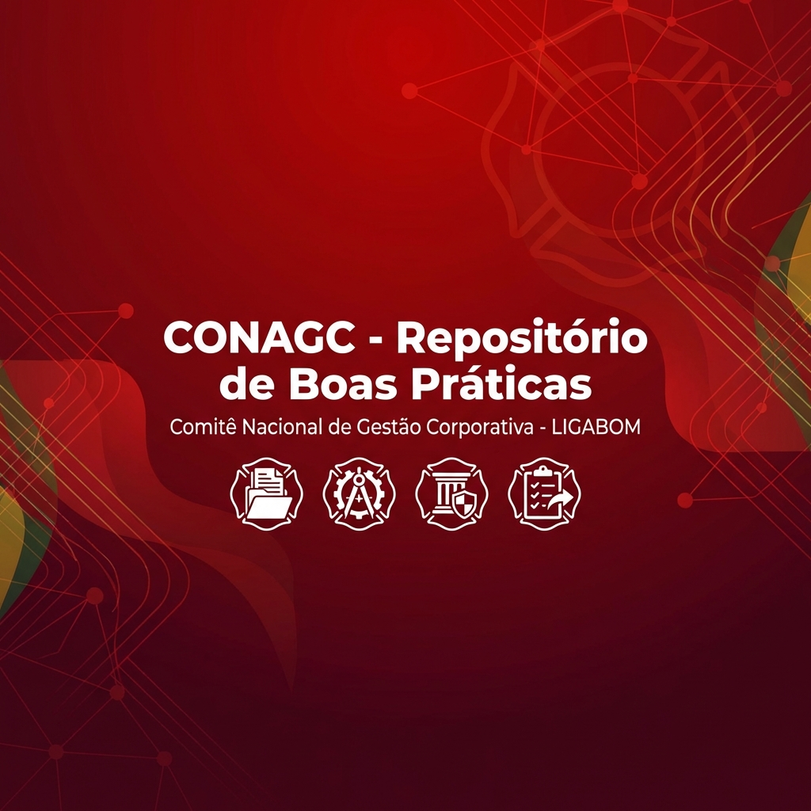

<div align="center">


# 📚 Repositório de Boas Práticas - CONAGC

**Comitê Nacional de Gestão Corporativa da LIGABOM**

[](https://reactjs.org/)
[](https://www.typescriptlang.org/)
[](https://vitejs.dev/)
[](https://tailwindcss.com/)
[](LICENSE)

[🚀 Demo ao Vivo](https://ai.studio/apps/drive/1Y8wlUwo31gwrDxPvjGydqS_XGhkd2xdW) • [📖 Documentação](#documentação) • [🤝 Contribuir](#como-contribuir)

</div>

---

## 📋 Sobre o Projeto

O **Repositório de Boas Práticas** é uma plataforma web desenvolvida para o **CONAGC** (Comitê Nacional de Gestão Corporativa) da **LIGABOM** (Liga Nacional dos Corpos de Bombeiros Militares do Brasil), com o objetivo de centralizar, catalogar e compartilhar as melhores práticas de gestão corporativa implementadas pelos diferentes Corpos de Bombeiros Militares em todo o Brasil.

### 🎯 Objetivos

- **Centralizar conhecimento** de gestão corporativa dos CBMs brasileiros
- **Facilitar o compartilhamento** de experiências e metodologias bem-sucedidas
- **Promover a replicação** de práticas eficazes entre diferentes corporações
- **Acompanhar o status** de implementação das iniciativas estratégicas
- **Fortalecer a governança** e gestão institucional dos Corpos de Bombeiros

---

## ✨ Funcionalidades

### 🔍 **Sistema de Filtros Avançado**

- Filtro por CBM de origem
- Filtro por áreas de impacto (8 categorias)
- Filtro por status de implementação
- Limpeza rápida de filtros

### 📊 **Dashboard Analítico**

- Visão geral com estatísticas principais
- Gráfico de distribuição por status
- Contadores de práticas consolidadas e em andamento
- Filtros interativos através do dashboard

### 📝 **Gestão de Práticas**

- Visualização em cards responsivos
- Modal detalhado com todas as informações
- Formulário completo para adicionar novas práticas
- Validação em tempo real

### 📄 **Exportação de Dados**

- Exportação para PDF com layout profissional
- Filtros aplicados mantidos na exportação
- Branding institucional CONAGC
- Paginação automática

### 🎨 **Interface Moderna**

- Design responsivo (mobile, tablet, desktop)
- Paleta de cores institucional
- Transições suaves e animações
- Acessibilidade (ARIA labels, navegação por teclado)

---

## 🏗️ Arquitetura Técnica

### **Stack Tecnológico**

```
Frontend:
├── React 19.2.0          # Framework UI
├── TypeScript 5.8.2      # Tipagem estática
├── Vite 6.2.0            # Build tool
└── TailwindCSS 3.x       # Estilização

Bibliotecas:
├── jsPDF                 # Geração de PDFs
└── jsPDF-AutoTable       # Tabelas em PDF
```

### **Estrutura de Pastas**

```
src/
├── components/           # Componentes React
│   ├── Dashboard.tsx     # Dashboard analítico
│   ├── Header.tsx        # Cabeçalho e navegação
│   ├── PracticeCard.tsx  # Card de prática
│   ├── PracticeDetailModal.tsx  # Modal de detalhes
│   ├── PracticeForm.tsx  # Formulário de cadastro
│   ├── Sidebar.tsx       # Barra lateral de filtros
│   └── icons.tsx         # Componentes de ícones
├── data/
│   └── practices.ts      # Dados iniciais
├── App.tsx               # Componente principal
├── types.ts              # Definições TypeScript
└── index.tsx             # Ponto de entrada
```

---

## 🚀 Como Executar

### **Pré-requisitos**

- Node.js 18+ instalado
- npm ou yarn

### **Instalação**

```bash
# Clone o repositório
git clone https://github.com/gabrieldantass5/Reposit-rio-de-Boas-Pr-ticas---CONAGC.git

# Entre no diretório
cd Reposit-rio-de-Boas-Pr-ticas---CONAGC

# Instale as dependências
npm install
```

### **Desenvolvimento**

```bash
# Inicie o servidor de desenvolvimento
npm run dev

# Acesse no navegador
# http://localhost:5173
```

### **Build para Produção**

```bash
# Gere a build otimizada
npm run build

# Visualize a build localmente
npm run preview
```

---

## 📊 Áreas de Impacto

O repositório categoriza as práticas em **8 áreas estratégicas**:

| Área | Descrição |
|------|-----------|
| 🎯 **Planejamento Estratégico** | Metodologias de planejamento, BSC, OKRs |
| 🏛️ **Governança Corporativa** | Políticas, compliance, estruturas de governança |
| ⚠️ **Gestão de Riscos** | Identificação, análise e mitigação de riscos |
| 📋 **Gestão de Projetos** | PMO, metodologias ágeis, portfólio de projetos |
| 👥 **Gestão de Pessoas** | RH, capacitação, clima organizacional |
| 💰 **Orçamento e Finanças** | Planejamento orçamentário, execução financeira |
| 📦 **Logística e Patrimônio** | Gestão de materiais, almoxarifado, frota |
| ⚙️ **Processos e Qualidade** | Mapeamento, otimização, certificações |

---

## 📈 Status de Implementação

As práticas são classificadas em 4 status:

- 🟢 **Consolidada**: Prática totalmente implementada e em operação
- 🔵 **Fase Inicial**: Em processo de implementação
- 🟡 **Piloto**: Projeto piloto em andamento
- 🔴 **Descontinuada**: Prática descontinuada

---

## 🗂️ Dados Atuais

O repositório contém atualmente **8 práticas** de:

- CBMPB (Paraíba)
- CBMAL (Alagoas)
- CBPMESP (São Paulo)
- CBMGO (Goiás)
- CBMMA (Maranhão)
- CBMAC (Acre)
- CBMRN (Rio Grande do Norte)
- CBMPR (Paraná)

---

## 🔮 Roadmap

### **Fase 1 - Atual** ✅

- [x] Interface responsiva
- [x] Sistema de filtros
- [x] Dashboard analítico
- [x] Exportação PDF
- [x] Formulário de cadastro

### **Fase 2 - Próximos Passos** 🚧

- [ ] Persistência de dados (LocalStorage)
- [ ] Funcionalidade de busca textual
- [ ] Ordenação de resultados
- [ ] Exportação para Excel/CSV
- [ ] Modo escuro

### **Fase 3 - Futuro** 🔮

- [ ] Backend e banco de dados
- [ ] Sistema de autenticação
- [ ] Edição e exclusão de práticas
- [ ] Upload de imagens e documentos
- [ ] Sistema de comentários
- [ ] Analytics avançado

---

## 🤝 Como Contribuir

Contribuições são bem-vindas! Siga os passos abaixo:

1. **Fork** o projeto
2. Crie uma **branch** para sua feature (`git checkout -b feature/NovaFuncionalidade`)
3. **Commit** suas mudanças (`git commit -m 'Adiciona nova funcionalidade'`)
4. **Push** para a branch (`git push origin feature/NovaFuncionalidade`)
5. Abra um **Pull Request**

### **Diretrizes de Contribuição**

- Mantenha o código limpo e bem documentado
- Siga os padrões TypeScript do projeto
- Teste suas alterações antes de submeter
- Atualize a documentação quando necessário

---

## 📝 Estrutura de Dados

### **Interface Practice**

```typescript
interface Practice {
  nomeDaPratica: string;
  cbmDeOrigem: string;
  responsavel: string;
  areasDeImpacto: ImpactArea[];
  status: ImplementationStatus;
  resumo: string;
  temaApresentacao: string;
  problemaAbordado: string;
  metodologia: string;
  resultados: string;
  licoesAprendidas: string;
  comentariosAdicionais: string;
}
```

---

## 🎨 Paleta de Cores

```css
Primária:    #BD030B (Vermelho CONAGC)
Sucesso:     #10B981 (Verde - Consolidada)
Info:        #3B82F6 (Azul - Fase Inicial)
Alerta:      #F59E0B (Amarelo - Piloto)
Perigo:      #EF4444 (Vermelho - Descontinuada)
Neutros:     #F9FAFB, #F3F4F6, #E5E7EB (Cinzas)
```

---

## 📄 Licença

Este projeto está sob a licença **MIT**. Veja o arquivo [LICENSE](LICENSE) para mais detalhes.

---

## 👥 Equipe

Desenvolvido para o **CONAGC** - Comitê Nacional de Gestão Corporativa da LIGABOM

### **Contato**

- 📧 Email: <contato@conagc.gov.br>
- 🌐 Website: [LIGABOM](https://ligabom.org.br)
- 📱 LinkedIn: [CONAGC](https://linkedin.com/company/conagc)

---

## 🙏 Agradecimentos

Agradecemos a todos os Corpos de Bombeiros Militares que contribuíram com suas práticas de gestão, tornando este repositório uma ferramenta valiosa para toda a comunidade bombeiro militar brasileira.

---

<div align="center">

</div>
